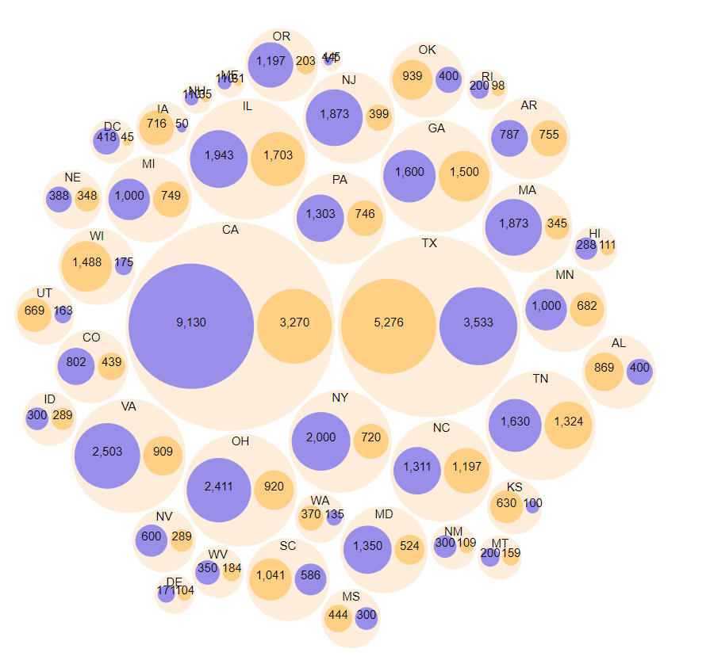
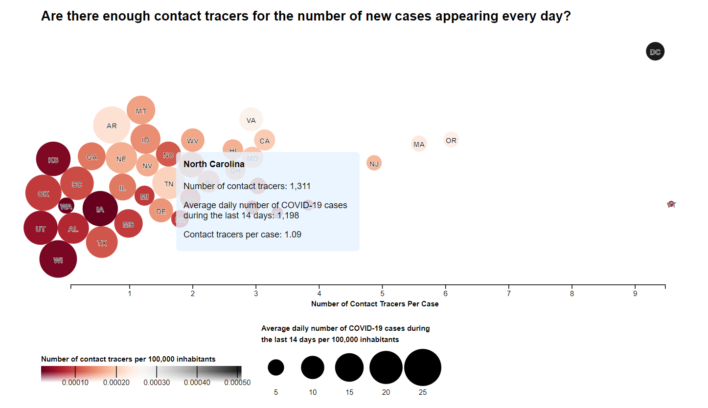

# cci-contact-tracing
sample assignment for CCI position

## Sketch One

## Sketch Two

## Explanation:
In exploring the data initially I wanted to focus in on the relationship of the contract tracer to case ratio between the states in the dataset. Not all states were represented so I didn't want to show a map with gaps and I thought juxtoposition of placement would tell a stronger story. 

I built out the design in sketch two. I think the story being told here is that most of the states in the dataset have between 0 and 3 contract tracers per case at the current caseload. What's also visible is that states with higher 14-day case averages per 100,000 people (the size of the circle) correspond strongly to the states where the average number of contact tracers per 100,000 people (the color gradient) is the smallest. 